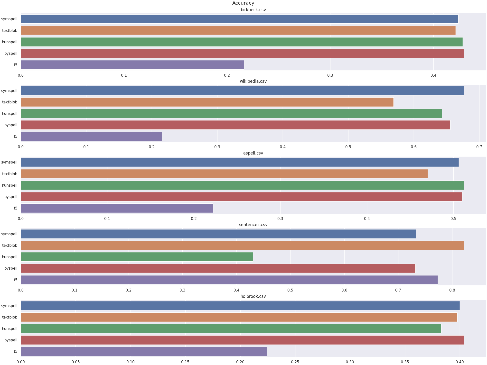
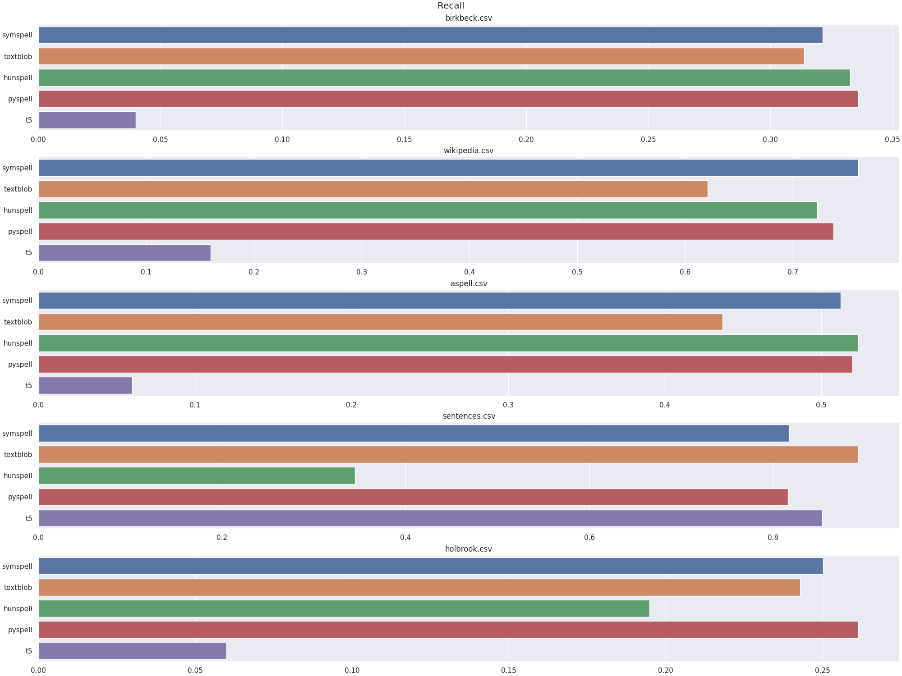

# Improving Writing Assistance at JetBrains AI

This project aims to explore and evaluate existing spell checking tools on various datasets.

## 1. Data sources

1. [Birkbeck Spelling Error Corpus](https://www.dcs.bbk.ac.uk/~roger/missp.dat) - This dataset, developed by the University of London, contains a collection of spelling errors commonly made by English speakers. It provides valuable examples of erroneous word forms and their correct counterparts, making it ideal for testing and training spell-checking tools.
2. [Holbrook Corpus](https://www.dcs.bbk.ac.uk/~roger/holbrook-missp.dat) - This corpus includes English sentences annotated with common spelling mistakes and their corrections. The dataset allows for a comprehensive study of spelling errors in real-world contexts, helping to refine spelling correction models by providing a variety of sentence structures.

**Note**: data in `data/holbrook/data.dat` has been modified by removing first 21 rows from the original dataset (first 20 rows describe words which had no targets)

3. [Aspell Testing Corpus](https://www.dcs.bbk.ac.uk/~roger/aspell.dat) - Derived from the Aspell spell-checker, this dataset consists of a list of misspelled words and their correct versions. The data is particularly useful for benchmarking spell-checking tools, as it includes a broad range of typographical errors commonly encountered in everyday text.
4. [Wikipedia Misspelings Dataset](https://www.dcs.bbk.ac.uk/~roger/wikipedia.dat) - Compiled from Wikipedia entries, this dataset includes frequently observed misspellings from a large online corpus. It captures the kinds of spelling errors users make on public platforms, aiding in developing models that perform well in diverse and noisy text environments.
5. [English Sentences (with randomly introduced errors)](https://www.kaggle.com/datasets/nikitricky/random-english-sentences) - This Kaggle dataset contains English sentences where errors have been artificially introduced at random (code used for introducing errors is available at `data/sentences/gen_errors.py`). It provides a controlled environment to assess spell-checking performance across varying error types and sentence contexts, simulating real-world typos and mistakes.

## 2. Tools used in comparisons

1. [pyspellchecker](https://github.com/barrust/pyspellchecker?tab=readme-ov-file) - python-based spell-checking tool that utilizes Levenshtein distance to identify and suggest corrections for misspelled words.
2. [Hunspell](https://github.com/hunspell/hunspell) -  an open-source spell checker widely used in applications like LibreOffice, OpenOffice, Firefox, and Chrome. It supports complex languages and morphological structures, handling compound words and allowing custom dictionaries. For Python intergration, I've used library `pyhunspell` available [here](https://github.com/pyhunspell/pyhunspell).
3. [Vennify's T5 Grammar Correction transformer](https://huggingface.co/vennify/t5-base-grammar-correction) - a T5-based transformer model trained specifically for grammar correction, available on Hugging Face. This model leverages deep learning to handle a wide range of language errors, making it suitable for complex correction tasks that go beyond basic spelling.
4. [SymSpell](https://github.com/wolfgarbe/SymSpell) - known for its speed, SymSpell uses a dictionary-based approach to provide fast, memory-efficient spell correction. It’s ideal for large datasets or applications where rapid error detection and correction are critical.
5. [TextBlob](https://github.com/sloria/TextBlob) - a Python library for processing textual data, providing spell-checking as part of its toolkit.

## 3. Metrics

1. **Latency** - Indicates the time taken by the model to process and output corrections for each input, essential for evaluating the model's efficiency, especially in real-time or resource-constrained applications.
2. **Accuracy** - Measures the proportion of correctly predicted corrections among all predictions, giving a general sense of the model’s performance in identifying and correcting errors.
3. **Precision** - Focuses on the accuracy of the corrections the model suggests, defined as the proportion of correctly corrected errors out of all the corrections made by the model. This metric is important for minimizing false positives.
4. **Recall** - Represents the model's ability to catch all actual errors by indicating the proportion of correctly corrected errors out of the total errors present. High recall is essential for ensuring that the model identifies as many errors as possible.
5. **$F_{1}$-score** - A harmonic mean of Precision and Recall, this metric balances the trade-off between these two metrics, providing a single score that reflects both the correctness of the corrections and the model’s ability to capture errors comprehensively.

## 4. Results

Overview of Results (based on `average_values.csv`):

| Tool | Avg. Latency [ms] | Avg. Precision | Avg. Recall | Avg. F1-score | Avg. Accuracy |
|------|-------------------|----------------|-------------|---------------|---------------|
| SymSpell | 2,915 | 0.53421 | 0.53425 | 0.53425 | 0.53423 | 0.54859 |
| TextBlob | 63.54832 | 0.49863 | 0.49916 | 0.49889 | 0.53519 |
| Hunspell | 45.54383 | 0.42285 | 0.42366 | 0.42325 | 0.47944 |
| Pyspell | 113.17942 | 0.53382 | 0.53368 | 0.53375 | 0.54600 |
| T5 | 2063.67870 | 0.18166 | 0.21569 | 0.19147 | 0.32281 |

### 4.1 Latency

- **Fastest models**: `symspell` has the lowest latency, with times ranging from ~0.3 seconds (`aspell.csv`, `wikipedia.csv`) to ~12 seconds (`sentences.csv`). `hunspell` also performs relatively quickly, with latencies generally around 20–25 seconds, except for `sentences.csv`, where latency spikes to ~141 seconds.
- **Slowest models**: `T5` is consistently the slowest, with latencies exceeding 1800 seconds across datasets. This shows that T5’s deep learning-based approach, while more powerful, requires significantly more processing time.

For applications needing real-time or faster spell-checking, `symspell` or `hunspell` would be a good choice, whereas `T5` models may be more suitable where time is not a critical factor.

### 4.2 Accuracy

- **Highest accuracy models**: `textblob` achieves the highest accuracy on `sentences.csv` (0.82) and is generally competitive on other datasets. `symspell` also performs well, especially on the same dataset, reaching ~0.73 accuracy.
- **Lowest accuracy models**: `T5` has the lowest accuracy in most datasets, with the highest on `sentences.csv` (0.73) but struggling on `aspell`, `birkbeck`, `holbrook`, and `wikipedia` datasets, likely due to more complex errors.

### 4.3 Precision, recall and $F_{1}$-score

- **Top performers**: `symspell`, `textblob`, and `pyspell` perform better in precision and recall across most datasets. `symspell` shows balanced precision and recall, especially in `sentences.csv`, where it achieves over 0.8 in both metrics.

- **Low scoring models**: `T5` performs poorly in datasets like `aspell.csv`, `birkbeck.csv`, and `holbrook.csv`, with very low precision and recall. However, it performs better on `sentences.csv` (precision ~0.81), possibly because this dataset has less complex corrections.

### Overall summary

- if looking for speed and accuracy `symspell` and `textblob` seem like the best choices,
- the `t5` model, though slower and less accurate, might be more appropiate for more subtle language tasks, given additional tuning,
- `hunspell` offers support for more complex language structures like compounds and custom dictionaries which might make it a better choice in more sophisticated language tasks even though its' recall and F1 score aren't as high as `textxblob`,

## 5. Approach description

### 5.1 Dataset selection

In order to test the models I've chosen a diverse set of different well-known corpora as well as synthetic datasets created by randomly introducing errors. This variety was crucial for assessing how each model performed under different conditions.

### 5.2 Model selection

I selected several popular spell-checking tools like `pyspellchecker`, `Hunspell`, `SymSpell`, `TextBlob`, and `Vennify’s T5 Grammar Correction transformer`. Each of these tools has different strengths, from basic spell-checking to handling complex languages, allowing for a comprehensive comparison.

### 5.3 Metrics for evaluation

I've chosen accuracy, latency, precision, recall, and F1-score since they are commonly employed in research across various fields, particularly in machine learning, natural language processing, and spell-checking systems.

### 5.4 Implementation

I've tracked each model's outputs on the prepared data and calculated the number of true positives, false positives, true negatives and false negatives to compute necessary metrics.

## 6. Challenged encoutered

- **Usage of `T5` model**: sometimes the model produced unexpected and nonsensical text. This issue probably stemmed from the model's reliance on the training data, which sometimes included phrases that, while grammatically correct, didn't make sense in context. For example, instead of suggesting a straightforward correction for a misspelled word, `T5` might generate a convoluted sentence that contained unrelated terms or altered the intended meaning entirely. Because of that I had to change my way of calculating confusion matrix with sets which is not as correct, but gives similar results.
- **Gathering data**: due to issues with availability and quality, I couldn't find many good datasets to compare models on
- **Resource constraints**: Limited access to computational resources and data preprocessing tools slowed the data-gathering and model usage process, making it difficult to use large models and datasets.

## 7. Steps to reproduce results

1. Create a virtual environment with `venv` or `conda`
2. Copy the repository with `git clone https://github.com/dec0dedd/jetbrains-writing-assistance.git`
2. Install all the required dependencies with `pip install -r requirements.txt`
3. Download all the required datasets and put them in their respective `data.dat` files (e.g. holbrook corpus should be put in `data/holbrook/data.dat` while aspell testing corpus in `data/aspell/data.dat`) or use already prepared ones
3. Run `make parse_data` to generate all parsed CSV files for testing models (or use already available data from `data/`)
4. Run `make run_all` to run all models to generate model metrics (or use already available metric data from `metrics/`)
5. Re-create all plots based on new data with command `python gen_results.py`. Metric data will be available in CSV format in `metric_data/{model_name}.csv`, e.g. `metric_data/t5.csv` or `metric_data/textblob.csv`
6. New plots based on generated results will be available in `plots/` with name `{metric}.png`, e.g. `latency.png`