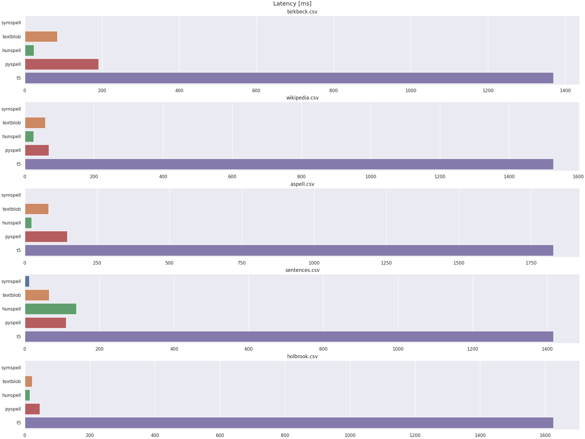

# Improving Writing Assistance at JetBrains AI

This project aims to explore and evaluate existing spell checking tools on various data.

## 1. Data sources

1. [Birkbeck Spelling Error Corpus](https://www.dcs.bbk.ac.uk/~roger/missp.dat) - This dataset, developed by the University of London, contains a collection of spelling errors commonly made by English speakers. It provides valuable examples of erroneous word forms and their correct counterparts, making it ideal for testing and training spell-checking tools.
2. [Holbrook Corpus](https://www.dcs.bbk.ac.uk/~roger/holbrook-missp.dat) - This corpus includes English sentences annotated with common spelling mistakes and their corrections. The dataset allows for a comprehensive study of spelling errors in real-world contexts, helping to refine spelling correction models by providing a variety of sentence structures.

**Note**: data in `data/holbrook/data.dat` has been modified by removing first 21 rows from the original dataset (first 20 rows describe words which had no targets)

3. [Aspell Testing Corpus](https://www.dcs.bbk.ac.uk/~roger/aspell.dat) - Derived from the Aspell spell-checker, this dataset consists of a list of misspelled words and their correct versions. The data is particularly useful for benchmarking spell-checking tools, as it includes a broad range of typographical errors commonly encountered in everyday text.
4. [Wikipedia Misspelings Dataset](https://www.dcs.bbk.ac.uk/~roger/wikipedia.dat) - Compiled from Wikipedia entries, this dataset includes frequently observed misspellings from a large online corpus. It captures the kinds of spelling errors users make on public platforms, aiding in developing models that perform well in diverse and noisy text environments.
5. [English Sentences (with randomly introduced errors)](https://www.kaggle.com/datasets/nikitricky/random-english-sentences) - This Kaggle dataset contains English sentences where errors have been artificially introduced at random (code used for introducing errors is available at `data/sentences/gen_errors.py`). It provides a controlled environment to assess spell-checking performance across varying error types and sentence contexts, simulating real-world typos and mistakes.

## 2. Tools used in comparisons

1. [pyspellchecker](https://github.com/barrust/pyspellchecker?tab=readme-ov-file) - python-based spell-checking tool that utilizes Levenshtein distance to identify and suggest corrections for misspelled words.
2. [Hunspell](https://github.com/hunspell/hunspell) -  an open-source spell checker widely used in applications like LibreOffice, OpenOffice, Firefox, and Chrome. It supports complex languages and morphological structures, handling compound words and allowing custom dictionaries. For Python intergration, I've used library `pyhunspell` available [here](https://github.com/pyhunspell/pyhunspell).
3. [Vennify's T5 Grammar Correction transformer](https://huggingface.co/vennify/t5-base-grammar-correction) - a T5-based transformer model trained specifically for grammar correction, available on Hugging Face. This model leverages deep learning to handle a wide range of language errors, making it suitable for complex correction tasks that go beyond basic spelling.
4. [SymSpell](https://github.com/wolfgarbe/SymSpell) - Known for its speed, SymSpell uses a dictionary-based approach to provide fast, memory-efficient spell correction. It’s ideal for large datasets or applications where rapid error detection and correction are critical, as it optimizes search through frequency-based suggestions.
5. [TextBlob](https://github.com/sloria/TextBlob) - a Python library for processing textual data, providing spell-checking as part of its toolkit.

## 3. Metrics

1. **Latency** - Indicates the time taken by the model to process and output corrections for each input, essential for evaluating the model's efficiency, especially in real-time or resource-constrained applications.
2. **Accuracy** - Measures the proportion of correctly predicted corrections among all predictions, giving a general sense of the model’s performance in identifying and correcting errors.
3. **Precision** - Focuses on the accuracy of the corrections the model suggests, defined as the proportion of correctly corrected errors out of all the corrections made by the model. This metric is important for minimizing false positives.
4. **Recall** - Represents the model's ability to catch all actual errors by indicating the proportion of correctly corrected errors out of the total errors present. High recall is essential for ensuring that the model identifies as many errors as possible.
5. **$F_{1}$-score** - A harmonic mean of Precision and Recall, this metric balances the trade-off between these two metrics, providing a single score that reflects both the correctness of the corrections and the model’s ability to capture errors comprehensively.

## 4. Results

Overview of Results (based on `average_values.csv`):

| Tool | Avg. Latency [ms] | Avg. Precision | Avg. Recall | Avg. F1-score | Avg. Accuracy |
|------|-------------------|----------------|-------------|---------------|---------------|
| SymSpell | 2,915 | 0.53421 | 0.53425 | 0.53425 | 0.53423 | 0.54859 |
| TextBlob | 63.54832 | 0.49863 | 0.49916 | 0.49889 | 0.53519 |
| Hunspell | 45.54383 | 0.42285 | 0.42366 | 0.42325 | 0.47944 |
| Pyspell | 113.17942 | 0.53382 | 0.53368 | 0.53375 | 0.54600 |
| T5 | 2063.67870 | 0.18166 | 0.21569 | 0.19147 | 0.32281 |

### 4.1 Latency

- **Fastest models**: `textblob`, `hunspell`, `pyspellchecker`, and `symspell` have extremely low latency (milliseconds) across all datasets, making them suitable for applications where speed is essential.
- **Slowest models**: 

### 4.2 Accuracy

- **Highest accuracy models**: abc 
- **Lowest accuracy models**: abc

### 4.3 Precision

- **Highest precision models**: abc
- **Lowest precision models**: abcge

### 4.4 Recal

- **Highest F1-score**: abc
- **Lowest F1-score**: abc

### $F_{1}$-score

- **abc**: def

## 5. Steps to reproduce results

1. Create a virtual environment with `venv` or `conda`
2. Copy the repository with `git clone https://github.com/dec0dedd/jetbrains-writing-assistance.git`
2. Install all the required dependencies with `pip install -r requirements.txt`
3. Download all the required datasets and put them in their respective `data.dat` files (e.g. holbrook corpus should be put in `data/holbrook/data.dat` while aspell testing corpus in `data/aspell/data.dat`) or use already prepared ones
3. Run `make parse_data` to generate all parsed CSV files for testing models (or use already available data from `data/`)
4. Run `make run_all` to run all models to generate model metrics (or use already available metric data from `metrics/`)
5. Re-create all plots based on new data with command `python gen_results.py`. Metric data will be available in CSV format in `metric_data/{model_name}.csv`, e.g. `metric_data/t5.csv` or `metric_data/textblob.csv`
6. New plots based on generated results will be available in `plots/` with name `{metric}.png`, e.g. `latency.png`